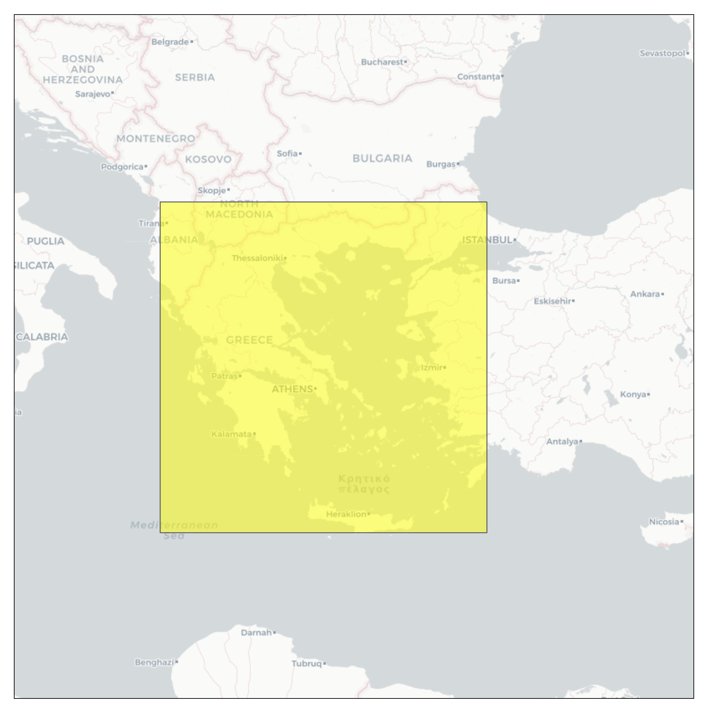
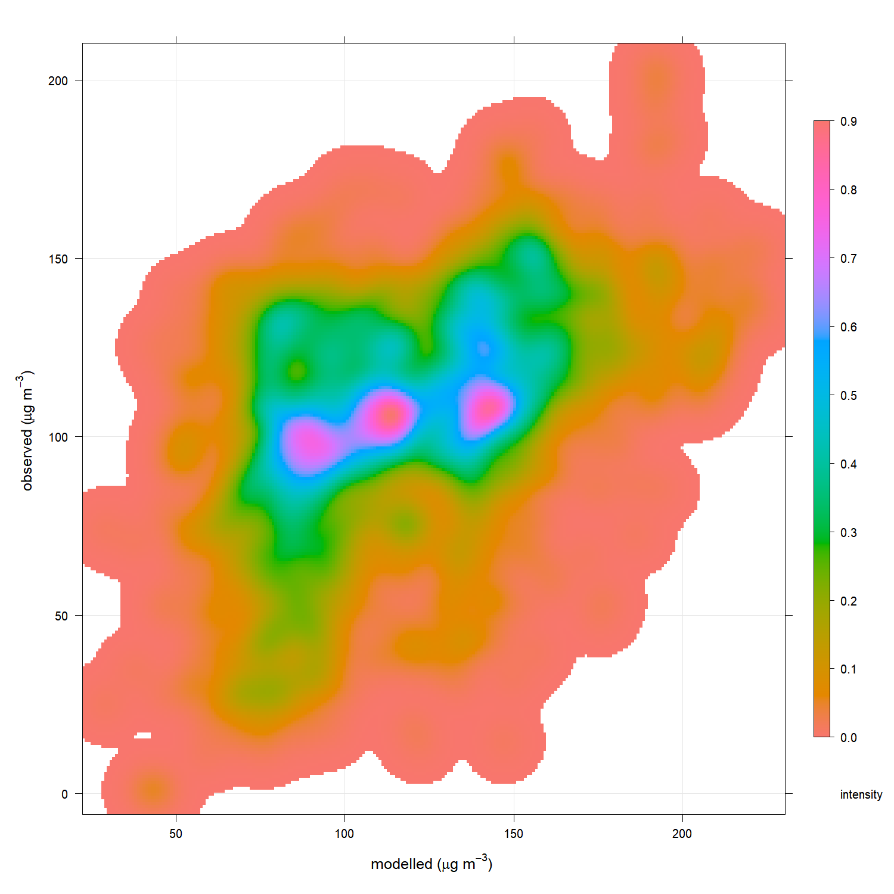
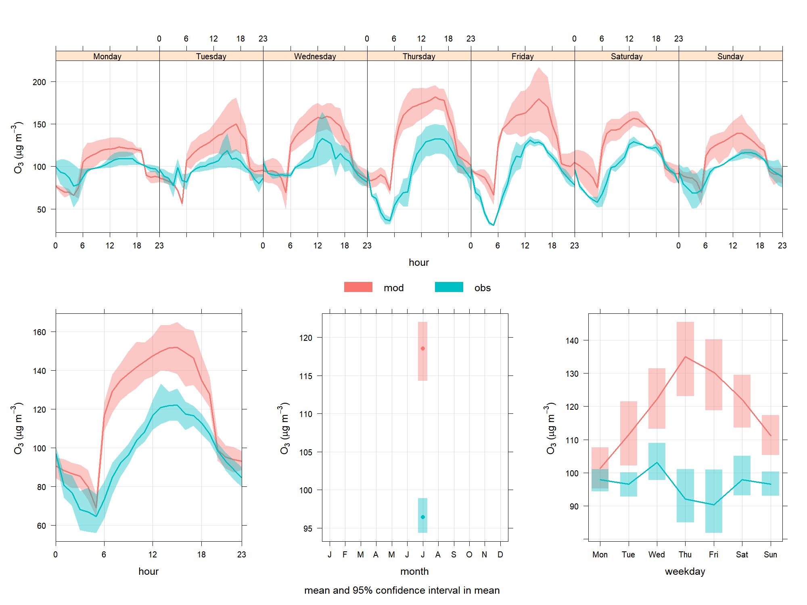

Tools for the processing of LOTOS-EUROS outputs
================

## Introduction

lotoseurosR is a collection of functions to aid the processing of inputs
and outputs for the LOTOS-EUROS (LE) chemistry transport model
https://lotos-euros.tno.nl/open-source-version/

All the functions are contained in the ‘functions.R’ file. The easiest
way to reproduce them is to open the ‘RUN_ME.R’ file where the functions
are used in code to generate the examples shown in this document.

Downloading the model and running with default settings will generate
the output in the mod_files/output folder. The examples given in this
document are based on these files but should also work with any surface
LE model output files.

The input_surf_concs and input_surf_meteo will import the concentration
or meteo outputs and output as a raster brick that can be plotted or
used with openair, worldmet and saqgetr to visualise the data and assist
with validation.

By converting to georeferenced raster layers and raster bricks, the
process of extracting time-series, regridding (e.g. to combine with data
on different grid systems/resolutions) and plotting is simplified and
sped up. Layered image files can also be an efficient file format in
terms of read/write speed and disk size, especially compared with
dataframes (e.g. csv). It should be noted that saving raster files as
other formats (e.g. native .RDS files) might appear to work, but they
are linked to the memory. On restarting R they appear to be loaded, but
when the RAM is cleared on restart they will be empty).

Below is a table of a some of the most common species. LE model outputs
are either in kg or mole per mole. To convert these to volume it is
neccesary to multiple by the molar weight and the temperature and
pressure. This can be simplified by combining into an omrekenfactor
factor which is multiplied by the mole mole value for species that
change with volume. tmap_nam is the structure needed to format the
species correctly in tmap.

| le_specs | omrekenfactor | tmap_nam                           | dg_nam                              |
|:---------|--------------:|:-----------------------------------|:------------------------------------|
| o3       |    1967213115 | ‘O’\[3\]\*’ (‘\* mu*’g/m’^3*’)’    | O<sub>3</sub> (μg/m<sup>3</sup>)    |
| no2      |    1885450820 | ‘NO’\[2\]\*’ (‘\* mu*’g/m’^3*’)’   | NO<sub>2</sub> (μg/m<sup>3</sup>)   |
| no       |    1229918033 | ‘NO (’\* mu*‘g/m’^3*’)’            | NO (μg/m<sup>3</sup>)               |
| nh3      |     697991803 | ‘NH’\[3\]\*’ (‘\* mu*’g/m’^3*’)’   | NH<sub>3</sub> (μg/m<sup>3</sup>)   |
| so2      |    2625524590 | ‘SO’\[2\]\*’ (‘\* mu*’g/m’^3*’)’   | SO<sub>2</sub> (μg/m<sup>3</sup>)   |
| hno3     |    2582377049 | ‘HNO’\[3\]\*’ (‘\* mu*’g/m’^3*’)’  | HNO<sub>3</sub> (μg/m<sup>3</sup>)  |
| co       |    1147950820 | ‘CO’\*’ (‘\* mu*’g/m’^3*’)’        | CO (μg/m<sup>3</sup>)               |
| tpm25    |    1000000000 | ‘PM’\[2.5\]\*’ (‘\* mu*’g/m’^3*’)’ | PM<sub>10</sub> (μg/m<sup>3</sup>)  |
| tpm10    |    1000000000 | ‘PM’\[10\]\*’ (‘\* mu*’g/m’^3*’)’  | PM<sub>2.5</sub> (μg/m<sup>3</sup>) |

table of varient names

Using the import_surf_concs function the surface concentration nc files
are opened and data for o3 and no2 output.

``` r
mod_out <- import_surf_concs(species = c('o3','no2'), path = 'files/output', output_units = 'volume')
```

The plotting function mod_plot will plot the output just generated for
o3. Each hour is animated up to a maximum of 64.

``` r
mod_plot(raster_list = mod_out, file_path = 'plots/rmd/', variable = 'o3')
```

 As the model domain is
quite large it is a good idea to reduce it. Using the function
get_country_domain a boundary box for a specific country, in this case
Greece, is returned

``` r
sub_domain <- get_country_domain(countries = c('Greece'))
```

 In this domain we are interested in the
observation sites that are available for the period of the model data
and the species. Using the function find_aq_sites the saqgetr pakcage is
used to interogate a database with European pollutant observation data
(described here in more detail
https://drive.google.com/file/d/1IgDODHqBHewCTKLdAAxRyR7ml8ht6Ods/view).
The period of data requested is based on the layer names in the raster
file, so it shouldn’t be neccesary to filter the returned data.

The function plot_obs generates a leaflet plot colouring the observation
sites by type and area.

``` r
obs_sites <- find_aq_sites(raster_list = mod_out, domain = sub_domain, type_def = c('background'), area_def = c('urban', 'rural', 'suburban'), species = c('o3'))
```

    FALSE [1] "all o3 sites imported between 2012-07-01 & 2012-07-15 23:00:00"

``` r
plot_obs(sites_sf = obs_sites, variable = 'o3')
```


The mod_obs_combine function joins the modelled and observed data, shown
below.

``` r
mod_obs <- mod_obs_combine(raster_list = mod_out, sites_sf = obs_sites, species = 'o3')
```

    [1] "o3"

``` r
s_mo <- slice(mod_obs, 1:15)
```

|       | date                | site    |      mod |      obs | species |
|:------|:--------------------|:--------|---------:|---------:|:--------|
| o3.1  | 2012-07-01 00:00:00 | gr0027a | 46.30494 | 102.7708 | o3      |
| o3.2  | 2012-07-01 01:00:00 | gr0027a | 41.74566 |  98.6875 | o3      |
| o3.3  | 2012-07-01 02:00:00 | gr0027a | 39.83857 |  99.4375 | o3      |
| o3.4  | 2012-07-01 03:00:00 | gr0027a | 38.46919 |  99.0000 | o3      |
| o3.5  | 2012-07-01 04:00:00 | gr0027a | 34.99684 |  98.3125 | o3      |
| o3.6  | 2012-07-01 05:00:00 | gr0027a | 27.41164 |  98.0000 | o3      |
| o3.7  | 2012-07-01 06:00:00 | gr0027a | 47.53975 |  98.1875 | o3      |
| o3.8  | 2012-07-01 07:00:00 | gr0027a | 46.91219 |  99.0625 | o3      |
| o3.9  | 2012-07-01 08:00:00 | gr0027a | 50.03563 |  99.7500 | o3      |
| o3.10 | 2012-07-01 09:00:00 | gr0027a | 52.17095 | 101.0625 | o3      |
| o3.11 | 2012-07-01 10:00:00 | gr0027a | 55.19944 | 103.0000 | o3      |
| o3.12 | 2012-07-01 11:00:00 | gr0027a | 56.97648 | 104.6250 | o3      |
| o3.13 | 2012-07-01 12:00:00 | gr0027a | 58.68116 | 106.4375 | o3      |
| o3.14 | 2012-07-01 13:00:00 | gr0027a | 58.95839 | 107.2500 | o3      |
| o3.15 | 2012-07-01 14:00:00 | gr0027a | 58.08797 | 108.5625 | o3      |

snapshot of modelled and observed concentrations

This data is now in the correct format to be input into many useful
openair functions (https://bookdown.org/david_carslaw/openair/). Below
is the modStats function which calculates model statistics showing how
well the modelled outputs compare with observed. This can be done for
all rows or split, in this case by site type.

``` r
ms_sites <- modStats(mod_obs, obs = "obs", mod = "mod",
         type = c("site"))

ms_all <- modStats(mod_obs, obs = "obs", mod = "mod")
```

Model statistics for all observation locations

| default  |    n |     FAC2 |        MB |     MGE |        NMB |      NMGE |     RMSE |        r |       COE |        IOA |
|:---------|-----:|---------:|----------:|--------:|-----------:|----------:|---------:|---------:|----------:|-----------:|
| all data | 2841 | 0.655755 | -45.76426 | 47.5945 | -0.4337823 | 0.4511304 | 53.30668 | 0.471697 | -1.001368 | -0.0006835 |

model statistics for all

Model statistics split by site

| site    |   n |      FAC2 |        MB |      MGE |        NMB |       NMGE |     RMSE |         r |        COE |        IOA |
|:--------|----:|----------:|----------:|---------:|-----------:|-----------:|---------:|----------:|-----------:|-----------:|
| gr0027a | 360 | 0.8166667 | -36.15528 | 37.40461 | -0.3750210 |  0.3879797 | 40.68981 | 0.6163953 | -1.1472836 | -0.0685907 |
| gr0028a | 360 | 0.7611111 | -39.89689 | 41.51119 | -0.3983702 |  0.4144890 | 45.18740 | 0.6085717 | -1.0461502 | -0.0225546 |
| gr0031a | 360 | 0.7972222 | -30.84237 | 36.09256 | -0.3342482 |  0.3911461 | 40.52581 | 0.6389239 | -0.2880993 |  0.3559503 |
| gr0035a | 270 | 0.6518519 | -46.00148 | 47.67794 | -0.4495104 |  0.4658921 | 51.53089 | 0.4935744 | -1.3609752 | -0.1528924 |
| gr0037a | 360 | 0.3111111 | -74.03338 | 74.03338 | -0.5513080 |  0.5513080 | 75.38889 | 0.5836262 | -7.7517888 | -0.7714753 |
| gr0039a |  66 | 0.7272727 | -49.60003 | 49.60003 | -0.4181144 |  0.4181144 | 52.03854 | 0.6676085 | -2.5909444 | -0.4430435 |
| gr0045a |   5 | 0.0000000 |  21.02946 | 21.02946 | 21.0294640 | 21.0294640 | 21.04613 |        NA |       -Inf | -1.0000000 |
| gr0047a | 340 | 0.2764706 | -79.72997 | 79.72997 | -0.5741859 |  0.5741859 | 81.07151 | 0.5948331 | -5.0715077 | -0.6705925 |
| gr0110r | 360 | 0.9305556 | -19.98104 | 24.46932 | -0.2604362 |  0.3189374 | 28.08607 | 0.6236108 | -0.1525534 |  0.4237233 |
| gr0120a | 360 | 0.6750000 | -41.64445 | 41.64445 | -0.4040171 |  0.4040171 | 43.71639 | 0.7524655 | -2.5507040 | -0.4367314 |

model statistics split by site

Below are some examples of plots.

``` r
scatterPlot(mod_obs_1, x = "mod", y = "obs", 
            pch = 21:22, cex = 1.6, 
            fill = c("tomato"), 
            col = "white", 
            linear = TRUE, 
            xlab = "modelled (ug/m3)", 
            ylab = "observed (ug/m3)")
```


``` r
scatterPlot(mod_obs_1,
            x = "mod", y = "obs",
            method = "density",
            xlab = "modelled (ug/m3)", 
            ylab = "observed (ug/m3)")
```



``` r
timeVariation(site_var_1, pollutant = 'value', group = 'variable', ylab = 'o3 (ug/m3)')
```



<!-- If desired all species can be output from the model and plot using the CorPlot. The species available in the default model are: 'o3','no2', 'no', 'hno3', 'nh3', 'so2', 'co', 'n2o5', 'form', 'iso', 'pan', 'no3a_f', 'no3a_c', 'so4a_f', 'so4a_c', 'nh4a_f', 'ppm_f', 'ppm_c', 'ec_f', 'ec_c', 'pom_f', 'pom_c', 'na_ff', 'na_f', 'na_c', 'na_cc', 'na_ccc', 'dust_ff', 'dust_f', 'dust_c', 'dust_cc', 'dust_ccc', 'tpm25', 'tpm10', 'tnmvoc', 'tdust', 'tss' Also for the same location. -->

Meteo data can be imported in the same way and also plot as a sequental
hourly plot. Below is a plot of temperature for the full domain.

In the example files wind speed and direction are also output.


Wind speed and direction code adapted from this post
https://stackoverflow.com/questions/47880918/how-to-plot-wind-direction-with-lat-lon-and-arrow-in-ggplot2
